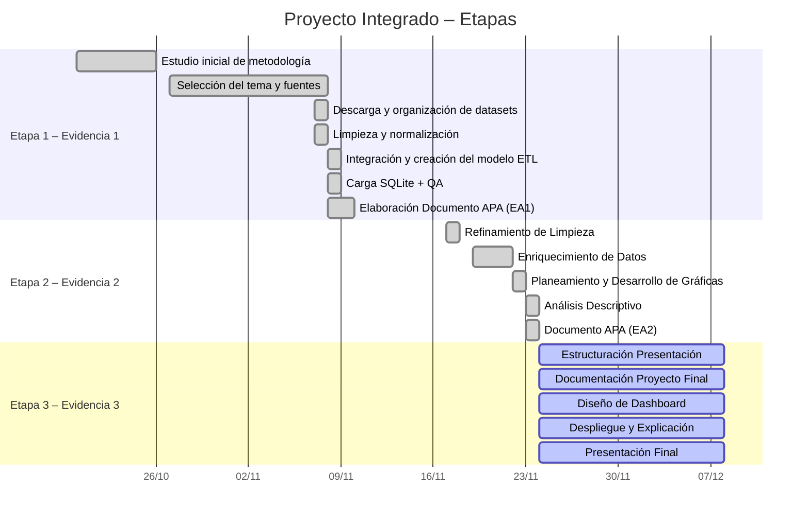

# 📘 **Etapa 1 – Evidencia 1**

### *Formulación de una necesidad de ingeniería de datos*

**Duración:** Semanas 1 a 3 (20 de octubre – 9 de noviembre 2025)
**Peso:** 35 % del proyecto
**Estado:** ✅ **Completada**

---

## 🧩 **Actividades desarrolladas en la Etapa 1**

| Nº | Actividad                                 | Descripción                                                                                                                         | Resultado / Evidencia                                               |
| -- | ----------------------------------------- | ----------------------------------------------------------------------------------------------------------------------------------- | ------------------------------------------------------------------- |
| 1  | **Definición del caso de uso**            | Se definió el proyecto *Análisis Económico Global 1960–2023* orientado al estudio de PIB, exportaciones, importaciones e inflación. | Descripción técnica en Documento APA y README.                      |
| 2  | **Selección y descarga de datasets**      | Se eligieron cuatro datasets de Kaggle (Frederick Salazar, 2023) con datos históricos del Banco Mundial.                            | Archivos en `/data/raw_data/`.                                      |
| 3  | **Normalización de datos**                | Se estandarizaron separadores, texto, codificación y formato de columnas.                                                           | Archivos en `/data/normalized_data/`.                               |
| 4  | **Integración y limpieza avanzada (ETL)** | Se creó el script `etl_unify_wdi.py` que unifica dimensiones, detecta indicadores, consolida hechos y genera un modelo analítico.   | Archivos en `/data/unified_clean/`.                                 |
| 5  | **Validación de calidad (QA)**            | Se generó un reporte automático con auditorías de duplicados, tipos, rangos y claves.                                               | Archivo `qa_report.csv`.                                            |
| 6  | **Creación de base de datos SQLite**      | Se materializó el modelo multidimensional en `/db/project.db`.                                                                      | Tablas: `dim_geo`, `dim_indicator`, `fact_indicators`, `fact_wide`. |
| 7  | **Exploración inicial en Jupyter**        | Se ejecutaron consultas SQL, gráficos preliminares y se validó la integridad del modelo.                                            | Notebook `run.ipynb`.                                               |
| 8  | **Documentación de resultados**           | Se elaboró el documento APA correspondiente a la Evidencia 1.                                                                       | Documento APA (Etapa 1) + README actualizado.                       |

---

# 📘 **Etapa 2 – Evidencia 2**

### *Análisis y visualización*

**Duración:** 10 al 23 de noviembre de 2025
**Peso:** 35 % del proyecto
**Estado:** ✅ **Completada**

---

## 🧩 **Actividades desarrolladas en la Etapa 2**

| Nº | Actividad                                 | Descripción                                                                                                                                                | Resultado / Evidencia                                               |
| -- | ----------------------------------------- | ---------------------------------------------------------------------------------------------------------------------------------------------------------- | ------------------------------------------------------------------- |
| 1  | **Refinamiento de limpieza**              | Se revisó la salida del ETL, se corrigieron valores atípicos, duplicados y se mejoraron reglas de inferencia de indicadores y códigos.                     | Datos depurados en `/data/unified_clean/`.                          |
| 2  | **Enriquecimiento de datos**              | Se incorporaron metadatos adicionales: nombres oficiales, regiones, subregiones, clasificación de agregados y simplificación de códigos de indicadores.    | Tablas actualizadas `dim_geo`, `dim_indicator` y `fact_indicators`. |
| 3  | **Planeamiento y desarrollo de gráficas** | Se definieron las visualizaciones clave del estudio (heatmaps, series temporales, comparativas y diagramas correlacionales) y se implementaron en Jupyter. | Gráficos generados en `run.ipynb`.                                  |
| 4  | **Análisis descriptivo**                  | Se analizaron patrones multianuales de PIB, inflación, comercio exterior y crecimiento económico, incluyendo comparaciones por país y región.              | Secciones de análisis documentadas en APA (Etapa 2).                |
| 5  | **Elaboración Documento APA (Etapa 2)**   | Integración de resultados visuales, descripción metodológica y redacción interpretativa correspondiente a la etapa de análisis descriptivo.                | Documento APA (Etapa 2).                                            |

---

# 📘 **Etapa 3 – Evidencia 3**

### *Interpretación, presentación y entrega final*

**Duración:** 24 de noviembre al 7 diciembre de 2025
**Peso:** 30 % del proyecto
**Estado:** ⚪ En proceso

---

## 🧩 **Actividades proyectadas en la Etapa 3**

| Nº | Actividad                            | Descripción                                                                                                                                             | Resultado / Evidencia esperada                                  |
| -- | ------------------------------------ | ------------------------------------------------------------------------------------------------------------------------------------------------------- | --------------------------------------------------------------- |
| 1  | **Estructuración de presentación**   | Diseño de la narrativa visual del proyecto final: problema, metodología, resultados, conclusiones e implicaciones.                                      | Presentación en formato PPT/Canva.                              |
| 2  | **Documentación del proyecto final** | Redacción del documento final consolidado con todas las etapas, análisis, metodología completa, anexos y referencias.                                   | Documento APA final.                                            |
| 3  | **Diseño de dashboard**              | Construcción de un dashboard funcional con indicadores seleccionados (PIB, inflación, comercio exterior) basado en la base SQLite y gráficos generados. | Dashboard interactivo (Jupyter/PowerBI/Tableau según elección). |
| 4  | **Despliegue y explicación**         | Presentación oral explicando la solución técnica, los hallazgos más relevantes y las decisiones metodológicas tomadas en el ETL y el análisis.          | Video o presentación grabada.                                   |
| 5  | **Presentación final**               | Exposición del trabajo completo ante el docente, con soporte visual y documentación final integrada.                                                    | Entrega de presentación final y exposición.                     |

---

## 📊 Estado General del Proyecto

| Etapa                                              | Periodo         | Evidencia   | Avance    | Estado        |
| -------------------------------------------------- | --------------- | ----------- | --------- | ------------- |
| **Etapa 1 – Formulación y BD (EA1)**               | 20 oct – 9 nov  | Evidencia 1 | **100 %** | ✅ Completado  |
| **Etapa 2 – Análisis y visualización (EA2)**       | 10 nov – 23 nov | Evidencia 2 | **100 %** | 🟩 Finalizada |
| **Etapa 3 – Interpretación y entrega final (EA3)** | 24 nov – 7 dic  | Evidencia 3 | 0 %       | ⚪ En proceso  |

## 🗂️ Gantt 

